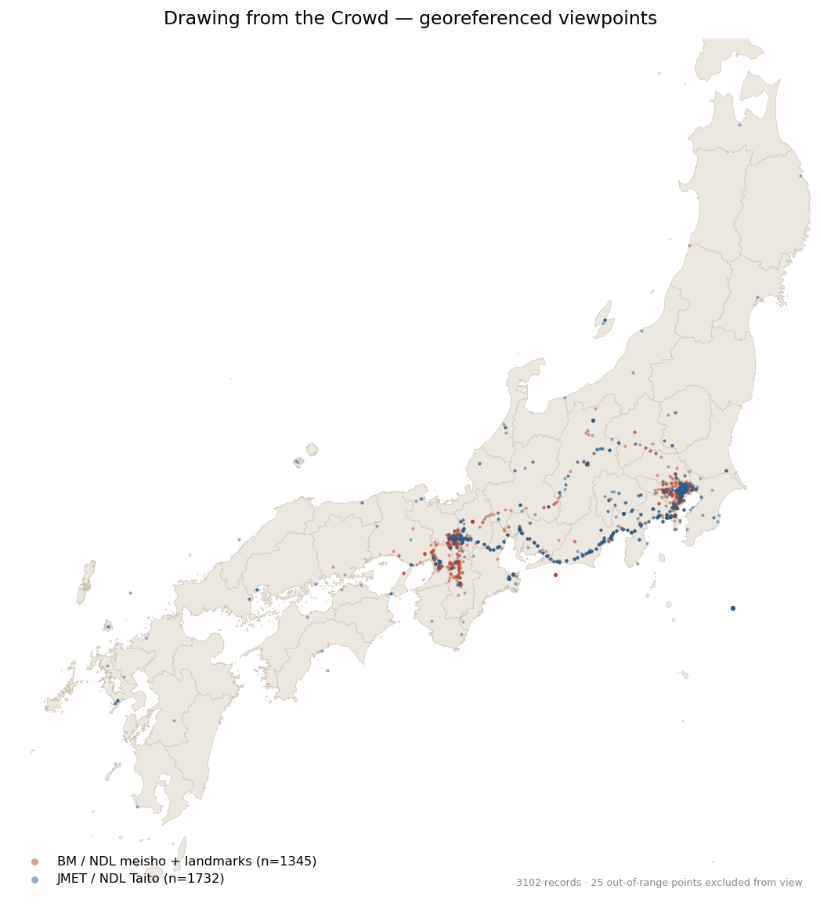

# Drawing from the Crowd — Dataset

Curated metadata for Edo-period Japanese landscape prints and illustrated books (*meisho-zue*), 
prepared for citizen-science georeferencing on the [Smapshot](https://smapshot.heig-vd.ch/) platform as part of the *Drawing from the Crowd* project: https://landscapes.theprintlab.org

This repository holds **metadata only**. 
Image columns link back to the holding institutions; no images are redistributed here.

## Map



All 3,102 records, plotted by a-priori viewpoint. 
An **interactive map renders directly on GitHub** — open [`dftc_points.geojson`](dftc_points.geojson) to pan, zoom, and click a point for its title, artist, and date. 
The two source batches are coloured separately; 25 records with out-of-range coordinates are flagged in the data (`in_japan_bbox: false`) and excluded from the static view above.

## Contents

```
data/
  bm_ndl_meisho_landmarks.csv   British Museum + NDL meisho-zue + National Archives of Japan
  jmet_ndl_taito.csv            NDL + ADEAC (via Japan Search) + Taito Lifelong Learning center
  artists.csv                   artist lookup table
docs/
  data-dictionary.md            every field, fill rates, known issues
  map_preview.png               static map of all viewpoints
dftc_points.geojson             all records as points (interactive on GitHub)
CURATION.md                     how the data was assembled and what was changed
AI_USE.md                       disclosure of AI assistance
CONTRIBUTING.md                 how to contribute and propose corrections
CITATION.cff                    how to cite
LICENSE-data.md                 license terms
```

## The data

Two record files share the Smapshot import format; `artists.csv` is a lookup they reference. 
`photographer_id` in each record file is a foreign key into `artists.id`. 
Field-by-field documentation, fill rates, and the list of provisional/flagged items are in [`docs/data-dictionary.md`](docs/data-dictionary.md); provenance and curation decisions are in [`CURATION.md`](CURATION.md).

**Loading note:** the record files use the Smapshot banded header — the real column names are on the second row, with a human-readable description on the third. 
Read the header from row 2 and skip row 3. Files are UTF-8.

## License

Dataset under **CC BY 4.0**; images are not included and remain with the holding institutions. See [`LICENSE-data.md`](LICENSE-data.md).

## Citing

See [`CITATION.cff`](CITATION.cff) (GitHub renders a "Cite this repository" button from it). 

Recommended project citation:
> Stephanie Santschi (PI), Himanshu Panday, Hirohito Tsuji, and Drew Richardson,
> "Drawing from the Crowd: A Citizen Science Platform for Mapping Ukiyo-e
> Cultural Geography," *ThePrintLab*, accessed [date],
> https://landscapes.theprintlab.org

## Team and funding

Stephanie Santschi (PI, University of Zurich), Himanshu Panday (Dignity in Difference), Hirohito Tsuji (University of East Anglia), and Drew Richardson (UC Santa Cruz). 
Prototype funded by The Nippon Foundation Scholars Association (NSIC 2024); 
implementation by a University of Zurich Graduate Campus Career Grant. 
Full credits and data sources are in [`CONTRIBUTING.md`](CONTRIBUTING.md).
